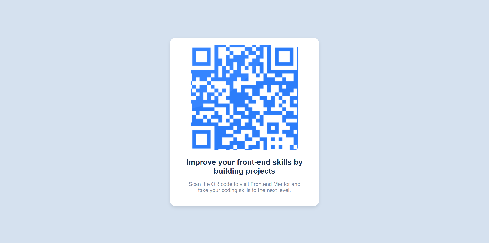

#  QR Code Component - Frontend Mentor Challenge

Ce projet est une solution au défi [QR code component](https://www.frontendmentor.io/challenges/qr-code-component-iux_sIO_H) sur **Frontend Mentor**. Ce défi m'a permis de pratiquer mes compétences en **HTML** et **CSS**, tout en appliquant des techniques de **responsive design**.

---

##  **Aperçu du projet**

 **Lien du projet en ligne** : [Voir le projet](https://joyful-rugelach-d181cc.netlify.app/)

 **Capture d'écran** :  

---

##  **Technologies utilisées**
- **HTML5**
- **CSS3** 
- **Flexbox** 
- **Media Queries** 
---

